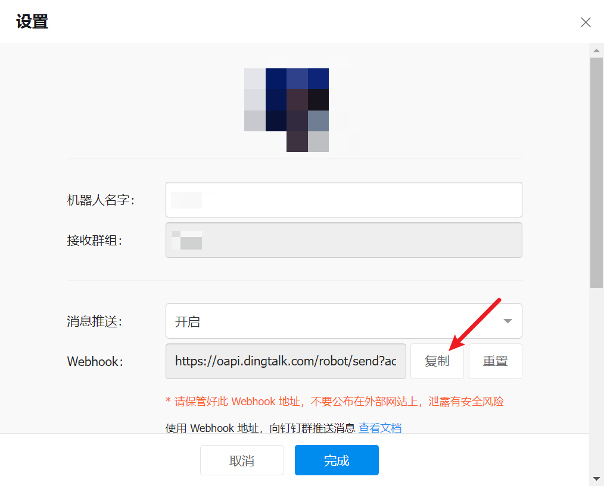

## ✈️ 一、工具特性

**CS-Dingtalk-Bot** 使用钉钉机器人 Webhook 进行 Cobalt Strike 主机上线提醒

## 🚨 二、配置

创建钉钉机器人，复制 Webhook 地址，粘贴到 `main.py` 的对应部分



```python
webhook = 'https://oapi.dingtalk.com/robot/send?access_token=xxx' // TODO 进行替换
```

修改 `CS-Dingtalk-Bot.cna` 中 python 脚本的绝对路径

```cna
$cmd = 'python3 /root/main.py' . " --computernam " . $computerName . " --internalip " . $internalIP . " --externalip " . $externalIP .  " --username " . $userName;
```

## 🚀 三、使用

由于 CS4.9 已经移除 agscript，因此只需客户端加载 `CS-Dingtalk-Bot.cna` 即可

## 🖐 四、免责声明

1. 如果您下载、安装、使用、修改本工具及相关代码，即表明您信任本工具
2. 在使用本工具时造成对您自己或他人任何形式的损失和伤害，我们不承担任何责任
3. 如您在使用本工具的过程中存在任何非法行为，您需自行承担相应后果，我们将不承担任何法律及连带责任
4. 请您务必审慎阅读、充分理解各条款内容，特别是免除或者限制责任的条款，并选择接受或不接受
5. 除非您已阅读并接受本协议所有条款，否则您无权下载、安装或使用本工具
6. 您的下载、安装、使用等行为即视为您已阅读并同意上述协议的约束